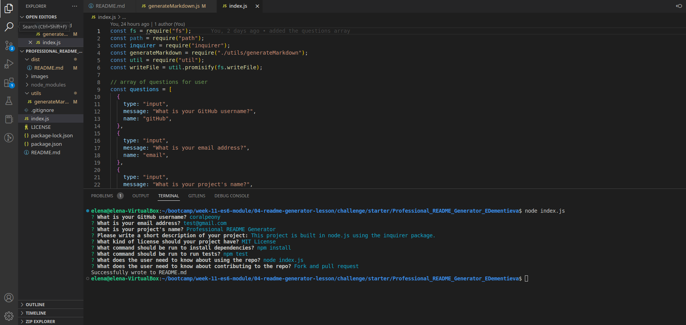

# Professional_README_Generator_EDementieva

  

## Description

The task in this Challenge is to create a command-line application that dynamically generates a professional README.md file from a user's input using the Inquirer package. This will allow the project creator to devote more time to working on the project. The application is invoked by using the following command: node index.js

## Installation

Use git clone to clone this project onto your local machine. To install necessary dependencies, run the following command: npm install

## Usage of the application:

When a user is prompted for information about the application repository, a high-quality, professional README.md is generated with:

    The title of the project

    Sections entitled:

    Description

    Table of Contents

    Installation

    Usage

    License

    Contributing

    Tests

    Questions

When a user enters the project title, it's displayed as the title of the README.

When a user enters a description, installation instructions, usage information, contribution guidelines, and test instructions, this information is added to the sections of the README entitled Description, Installation, Usage, Contributing, and Tests.

When a user chooses a license for their application from a list of options, a badge for that license is added near the top of the README and a notice is added to the section of the README entitled License that explains which license the application is covered under.

When a user enters their GitHub username, it's added to the section of the README entitled Questions, with a link to their GitHub profile.

When a user enters their email address, it's added to the section of the README entitled Questions, with instructions on how to reach them with additional questions.

When a user clicks on the links in the Table of Contents, they are taken to the corresponding section of the README.

https://drive.google.com/file/d/1RraoK2NlJP9l9kIUs03_CHa29_obwiMy/view?usp=share_link

## Credits

N/A

## License

MIT License